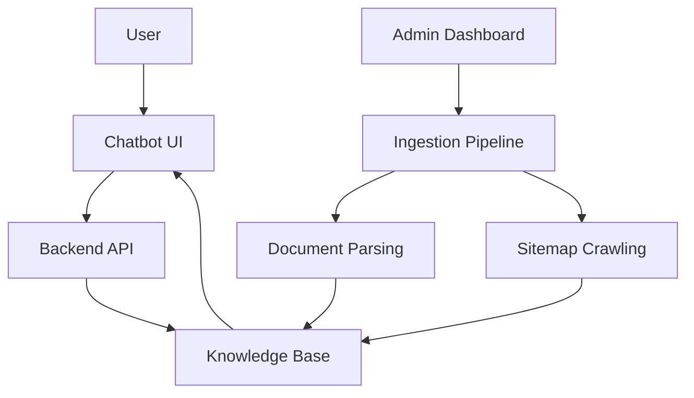
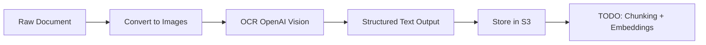
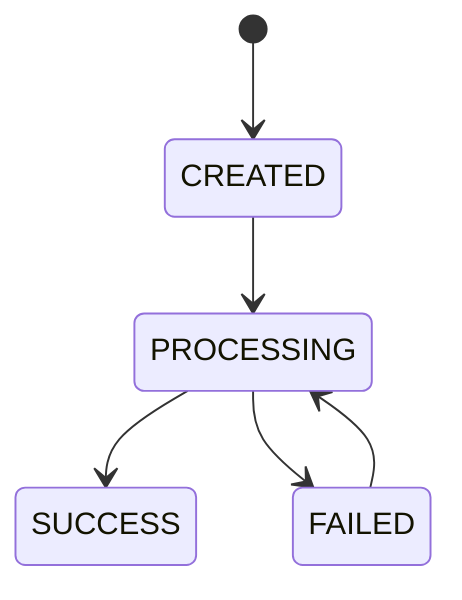

# 🧠 RAG Chatbot System for Suri Marketing (In Progress)

This project is a **production-style Retrieval-Augmented Generation (RAG) system** built for [Suri Marketing](http://surimarketing.co.uk/).

It includes:

- A **customer-facing chatbot interface** embedded into a website  
- An **admin dashboard** for managing knowledge ingestion and monitoring the chatbot  
- A **backend pipeline** that ingests, processes, and serves knowledge to the chatbot - utilising an RAG architecture integrated with a vector database.
- Preserves **in-dialogue context** across conversations.
- Utilises industry standard **sales strategies**.

🚧 **Status: Work in Progress**

---

## 📌 Overview

The goal of this system is to enable:

- Accurate, **grounded chatbot responses** using company knowledge  
- Easy and user-friendly ingestion of different types of documents and website content (through site-map crawling)
- A simple internal admin dashboard for non-technical users to monitor, configure and manage the chatbot  
- A scalable and cloud-native architecture, based on AWS, for real-world deployment

---

## 🧩 System Architecture

---

## 🧱 Core Components

### 1. Customer Chatbot Interface
- Embedded into website
- Sends user queries to Flask backend
- Returns responses generated using retrieved knowledge from knowledge database

---

### 2. Admin Dashboard
Internal interface for managing the system:

- Upload documents and enable sitemap crawling to update knowledge base
- Monitor document processing status
- (TODO) analytics and usage insights

---

### 3. Backend API (Flask)

Handles:
- Chat requests (LLM interaction)
- Document ingestion workflows
- Status polling
- Job Queueing using Celery and Redis
- Communication with AWS
---

### 4. Knowledge Ingestion

Supports multiple sources:

#### 📄 Document Upload
- Files uploaded via dashboard
- Stored in AWS S3
- Metadata stored in Postgres

#### 🌐 Website Crawling (WIP)
- Async crawler extracts website content
- Pages treated as documents in the system
- Stored in AWS S3

---

### 5. Processing Pipeline

- Documents converted to images
- Processed using AI-based OCR
- Converted into structured, chunk-ready text to be vectorised and stored in knowledge base

---

### 6. Storage Layer

#### AWS S3
- Raw documents
- Extracted text outputs

#### PostgreSQL
Stores:
- Document metadata
- Source type (document upload/site-map crawl)
- Document Processing status in ingestion pipeline
- Storage locations (S3 bucket + key)
- Error tracking

---

### 7. Retrieval Layer (RAG) 🚧

Planned functionality (TO DO):

- Chunk extracted text
- Generate embeddings
- Store in vector database (FAISS / pgvector)
- Retrieve relevant chunks per query
- Inject into LLM context

This enables:
- Grounded responses
- Reduced hallucination
- Domain-specific answers

---

## 🔄 Document Lifecycle

- Document lifecycles are carefully controlled via database state transitions
- Prevents invalid states and internal errors

---

## 🚀 Current Features

- ✅ File upload to AWS S3  
- ✅ Metadata tracking in Postgres  
- ✅ Document status polling API  
- ✅ OCR-based text extraction pipeline  
- ✅ Extracted text stored in S3  
- ✅ Threaded async processing  
- ✅ Basic admin dashboard  
- ✅ Chat endpoint connected to Open AILLM  

---

## ⚠️ Work in Progress

- ⏳ Vector database integration (core RAG step)  
- ⏳ Chunking and embedding pipeline  
- ⏳ Retrieval logic for grounding chatbot responses  
- ⏳ Replace threading with Celery + Redis
- ⏳ Improve multi-format support (DOCX, images, HTML)  
- ⏳ Authentication and security  

---

## 🧠 Design Focus

This project focuses on building the **system around AI**, not just the model:

- Data ingestion  
- Processing pipelines  
- Storage architecture  
- Retrieval mechanisms  
- User interfaces  

Because in real-world applications, performance depends more on **system design** than the model itself.

---

## 🛠️ Tech Stack

- **Backend:** Flask, Flask-RESTful  
- **Database:** PostgreSQL (psycopg2 + connection pooling)  
- **Storage:** AWS S3  
- **Async (current):** Python threading  
- **AI/OCR:** OpenAI models  
- **Parsing:** pdf2image  
- **Crawler:** crawl4ai  
- **Planned:** FAISS, Celery & Redis for job processing

---

Thanks for reading,
Aamir.
